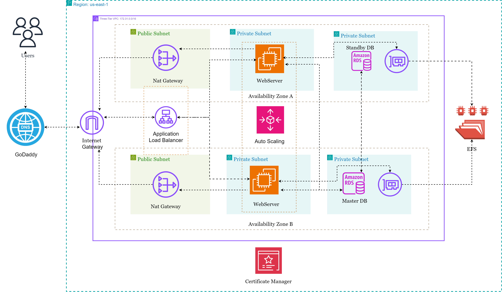

# Deploying WordPress on AWS Using a Three-Tier Architecture



## Introduction
Imagine a WordPress setup that’s scalable, secure, and resilient to traffic spikes! In this guide, we’ll deploy WordPress on AWS using a Three-Tier Architecture, dividing the setup into **Web**, **Application**, and **Database** layers for separation, security, and scalability.

## Building the Foundation: VPC and Subnet Creation
To start, we’ll create a Virtual Private Cloud (VPC) with a CIDR block of `172.31.0.0/16` in the EU-West-2 (London) region, but feel free to pick the most appropriate region for your needs. We’ll also create six public and private subnets spread across multiple Availability Zones (AZs) for high availability:

- **Public Subnets**: Host resources requiring internet access (e.g., Application Load Balancer).
- **Private Subnets**: Secure EC2 instances and RDS database, isolated from direct internet access.

### Routing Setup:
1. **Public Route Table** linked to an **Internet Gateway** allows outbound traffic from our public subnets.
2. **Private Route Table** routes traffic through a **NAT Gateway** so our private resources can still access the internet (for updates and patches) without exposing themselves directly.

### Securing the Infrastructure: Security Groups

No good architecture is complete without solid security boundaries. I created five security groups (SGs) to define the allowed traffic flow for this deployment. Let me break them down for you:

- **EC2 Instance Connect Endpoint (EICE) Security Group**: This SG only allows outbound SSH traffic on port 22 within the VPC. Why? Because we will access our EC2 instances via the EC2 Instance Connect Endpoint, avoiding the need for a bastion host or SSH keys.

- **ALB Security Group**: This group allows inbound HTTP (port 80) and HTTPS (port 443) traffic from anywhere. After all, we want our WordPress site to be accessible from anywhere.

- **Application Server Security Group**: We allow traffic only from the ALB on HTTP and HTTPS ports. We also permit SSH traffic, but only from our EC2 Instance Connect Endpoint SG—this means the EC2 instances are still safe from direct internet exposure.

- **RDS Security Group**: The database needs protection too. This SG only allows MySQL connections (port 3306) from the Application Server SG.

- **EFS Security Group**: Our Elastic File System (EFS) will use this SG to accept NFS traffic from our Application Servers.

With these SGs, we’ve set up a network where each tier can communicate with the one it needs to without opening unnecessary attack vectors.

## Setting Up EC2 Instance Connect Endpoint

EC2 Instance Connect Endpoint allows secure SSH access to your EC2 instances in private subnets without needing a bastion host or managing SSH keys. Follow the steps below to set up EC2 Instance Connect in your VPC.

### Step 1: Navigate to the VPC Console
1. Go to the **VPC Dashboard** in the AWS Management Console.
2. Select **Endpoints** from the left sidebar menu.

### Step 2: Create a New Endpoint
1. Click on **Create Endpoint**.
2. Under **Service category**, select **EC2 Instance Connect Endpoint**.

### Step 3: Configure Endpoint Settings
1. **VPC**: Choose the VPC where your EC2 instances are located.
3. **Security Groups**: Attach a security group `(created earlier)` that allows outbound SSH traffic (port 22) within the VPC.
   - Make sure the security group has the following rule:
     - **Outbound Rule**: Protocol: TCP, Port: 22, Destination: VPC CIDR range.
2. **Subnets**: Select the subnet `(private subnet)`where you want to create the Instance Connect Endpoint. This subnet must be in the same VPC as your EC2 instances.

### Step 4: Review and Create the Endpoint
1. Click on **Create endpoint** to finish the setup.
2. Wait for the status to change to **Available**.

### Step 5: Access Your EC2 Instances Using EC2 Instance Connect
1. Go to the **EC2 Dashboard**.
2. Deploy an **EC2 instance** (Amazon Linux 2023) in a private subnet.
3. Click **Connect**, then select the **EC2 Instance Connect Endpoint** option.
4. Select the **Endpoint** created earlier and
5. Click **Connect** to establish an SSH session to your instance directly through the AWS Console.

You’re now set up to connect to EC2 instances within your VPC securely and seamlessly, without requiring SSH key management or a bastion host.

## The Data Tier: RDS Setup
In this step, we’ll set up **Amazon RDS** with MySQL:

- **Instance Type**: `db.t3.micro`.
- **Security**: Password authentication and the RDS SG for restricted access to the Application Servers.

## File Storage: EFS Setup
For scalable file storage, **Amazon Elastic File System (EFS)** will serve WordPress files across instances and mounted to `/var/www/html/`. 

### EFS Mount Script:
```bash
#!/bin/bash
# Mount EFS to /var/www/html
EFS_DNS_NAME=fs-0010eb9b6121b2db3.efs.eu-west-2.amazonaws.com
sudo mkdir -p /var/www/html
sudo mount -t nfs4 -o nfsvers=4.1,rsize=1048576,wsize=1048576,hard,timeo=600,retrans=2,noresvport "$EFS_DNS_NAME":/ /var/www/html
```
This ensures our `/var/www/html` directory (where WordPress lives) is backed by **EFS**, providing persistent storage that scales independently of the instances.

## Distributing Traffic: Application Load Balancer
Configure an **Application Load Balancer (ALB)** to route internet traffic to EC2 instances running WordPress.

- **Listeners**: HTTP and HTTPS for secure connections.
- **Target Group**: EC2 instances to receive traffic from the ALB.

## Deploying WordPress on EC2
We’re now ready to deploy WordPress. Launch an EC2 instance with **Apache**, **PHP**, and **MySQL** installed. Here’s the setup script:

```bash
#!/bin/bash

# Update the package repository
sudo yum update -y

# Create /var/www/html directory
sudo mkdir -p /var/www/html

# Variable for EFS
EFS_DNS_NAME=fs-0010eb9b6121b2db3.efs.eu-west-2.amazonaws.com

# EFS Mount to the /var/www/html
sudo mount -t nfs4 -o nfsvers=4.1,rsize=1048576,wsize=1048576,hard,timeo=600,retrans=2,noresvport "$EFS_DNS_NAME":/ /var/www/html

# Install apache2
sudo yum install git httpd -y

# Install apache and php dependencies for the php web app
sudo yum install -y \
php \
php-cli \
php-cgi \
php-curl \
php-mbstring \
php-gd \
php-mysqlnd \
php-gettext \
php-json \
php-xml \
php-fpm \
php-intl \
php-zip \
php-bcmath \
php-ctype \
php-fileinfo \
php-openssl \
php-pdo \
php-soap \
php-tokenizer

# Install Mysql-Client 
sudo wget https://dev.mysql.com/get/mysql80-community-release-el9-1.noarch.rpm 
sudo dnf install mysql80-community-release-el9-1.noarch.rpm -y
sudo rpm --import https://repo.mysql.com/RPM-GPG-KEY-mysql-2023
sudo dnf repolist enabled | grep "mysql.*-community.*"
sudo dnf install -y mysql-community-server 

# Start and enable Apache & Mysql server
sudo systemctl start httpd
sudo systemctl enable httpd
sudo systemctl start mysqld
sudo systemctl enable mysqld

# set /var/www/html directory permissions
sudo usermod -aG apache ec2-user
sudo chown -R ec2-user:apache /var/www
sudo chmod 2775 /var/www && find /var/www -type d -exec sudo chmod 2775 {} \;
sudo find /var/www -type f -exec sudo chmod 0664 {} \;
chown apache:apache -R /var/www/html 

# Download Wordpress files and copy to /var/www/html
wget https://wordpress.org/latest.tar.gz
tar -xzf latest.tar.gz
sudo cp -r wordpress/* /var/www/html/

# create the wp-config.php file
sudo cp /var/www/html/wp-config-sample.php /var/www/html/wp-config.php
```

Edit `wp-config.php` to connect WordPress to the RDS database.

## Scaling Up: Auto Scaling Group
To handle fluctuating traffic, we’ll create an **Auto Scaling Group** (ASG). Using a **Launch Template**, new instances automatically mount EFS and start necessary services. This setup ensures resilience and adaptability. Here is the auto-scaling **launch template userdata script**:

```bash
#!/bin/bash

# update the software packages on the ec2 instance 
sudo yum update -y

# install the apache web server, enable it to start on boot, and then start the server immediately
sudo yum install -y git httpd
sudo systemctl enable httpd 
sudo systemctl start httpd

# install php 8 along with several necessary extensions for wordpress to run
sudo yum install -y \
php \
php-cli \
php-cgi \
php-curl \
php-mbstring \
php-gd \
php-mysqlnd \
php-gettext \
php-json \
php-xml \
php-fpm \
php-intl \
php-zip \
php-bcmath \
php-ctype \
php-fileinfo \
php-openssl \
php-pdo \
php-tokenizer

# Install Mysql-Client 
sudo wget https://dev.mysql.com/get/mysql80-community-release-el9-1.noarch.rpm 
sudo dnf install mysql80-community-release-el9-1.noarch.rpm -y
sudo rpm --import https://repo.mysql.com/RPM-GPG-KEY-mysql-2023
sudo dnf repolist enabled | grep "mysql.*-community.*"
sudo dnf install -y mysql-community-server 

# start and enable the mysql server
sudo systemctl start mysqld
sudo systemctl enable mysqld

# environment variable
EFS_DNS_NAME=fs-0010eb9b6121b2db3.efs.eu-west-2.amazonaws.com

# mount the efs to the html directory 
echo "$EFS_DNS_NAME:/ /var/www/html nfs4 nfsvers=4.1,rsize=1048576,wsize=1048576,hard,timeo=600,retrans=2 0 0" | sudo tee -a /etc/fstab
sudo mount -a

# set permissions
sudo chown apache:apache -R /var/www/html
sudo chmod 755 -R /var/www/html

# restart the webserver
sudo systemctl restart httpd
sudo systemctl restart php-fpm
```

## Wrapping Up: SSL Configuration
For security, configure **SSL** with the following steps:

- Add an HTTPS listener to the ALB.
- Update `wp-config.php` to enforce SSL: copy the script below into the `wp-config.php`

```php
/* SSL Settings */
define('FORCE_SSL_ADMIN', true);
if(isset($_SERVER['HTTP_X_FORWARDED_PROTO']) && $_SERVER['HTTP_X_FORWARDED_PROTO'] === 'https') {
  $_SERVER['HTTPS'] = '1';
}
```
- restart the httpd server: `sudo systemctl reload httpd`

For a more visual walkthrough, check out my YouTube video, linked below

First Video:

[](https://youtu.be/HpzWs5QjPYo)

Second Video:

[](https://youtu.be/67km4AFamY4)